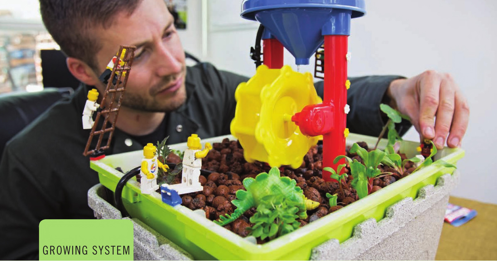
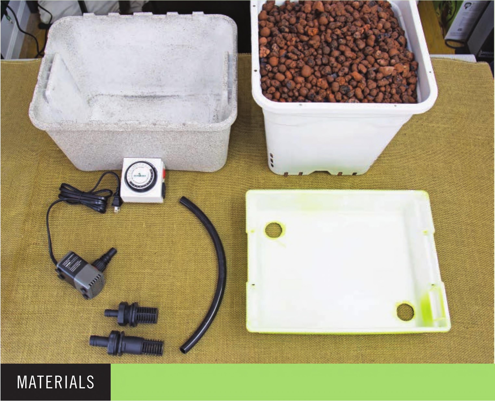
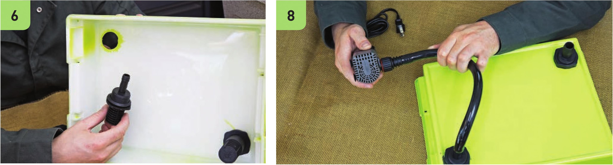
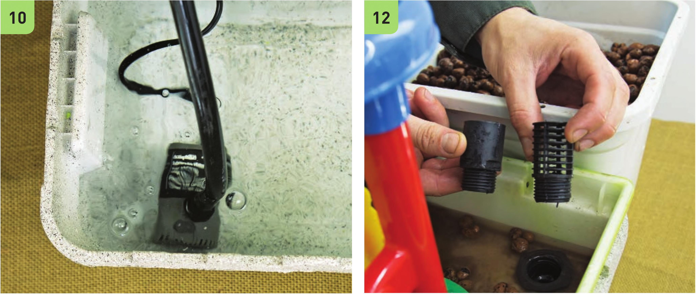
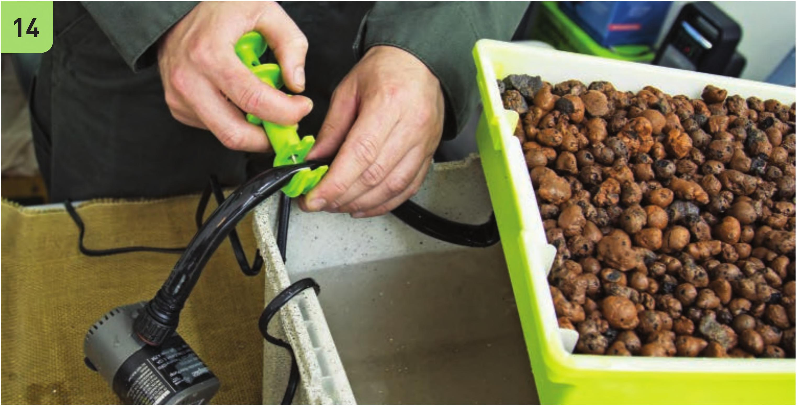
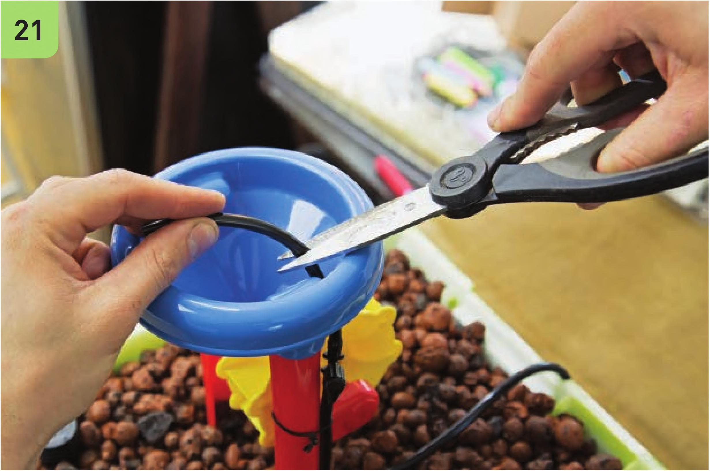
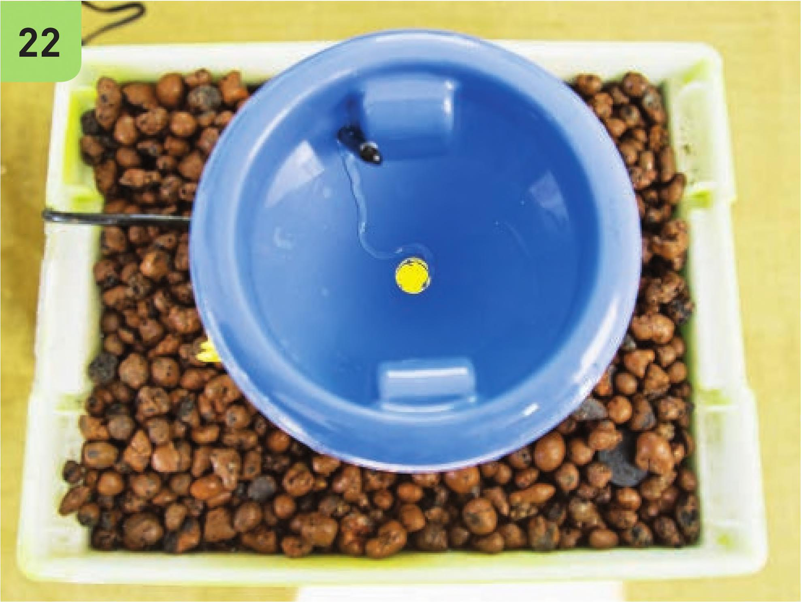

# Hydroponic Media Bed Setup

System: Media Bed (Fairy Garden Design)  
Source: *DIY Hydroponic Gardens* by Tyler Baras (Page 94-98)

---

## 📦 Materials Needed

### What the Finished System Looks Like



*The finished Media Bed with clay pebbles, plants, and optional waterwheel decoration. The grow bed sits on top of the reservoir.*

---

### Containers
| Item | Specification | Purpose |
|------|---------------|---------|
| **Grow Bed** | ~36 cm L x ~28 cm W x **~8 cm H** plastic tote | Holds substrate and plants |
| **Reservoir** | ~37 cm L x ~27 cm W x **~23 cm H** plastic tote (~15 L) | Holds nutrient solution |

**Important:** The bottom of the grow bed should fit inside the reservoir with the lip hanging over the edge.

### Irrigation Components
| Item | Specification |
|------|---------------|
| Fill/drain fitting combo kit | ~13 mm (1/2") fill/drain fitting with screen, ~19 mm (3/4") fill/drain fitting with screen |
| Black vinyl tubing | ~13 mm (1/2") diameter, ~36 cm length |
| Submersible water pump | ~600 L/hour (160 GPH) |
| Timer | For automated flood/drain cycles |

### Tools
- Drill
- **Step drill bit** with 6 mm increments from 6 mm to 35 mm
- Deburring tool (to smooth drilled holes)
- Heavy-duty scissors
- Work gloves & eye protection

### Substrate
- **10L Expanded clay pebbles** (Hydroton/LECA)
- Must be pre-rinsed before use

### Optional (Aesthetic)
- Scotch tape (for creating viewing window)
- Spray paint (make opaque to prevent algae)

---

### All Materials Layout



*All parts needed: Reservoir (painted gray), grow bed (white container with clay pebbles), timer, pump, tubing, fill/drain fittings, and grow bed lid with holes drilled.*

---

## 🔧 Step-by-Step Construction

### Step 1: Prepare Containers

#### 1.1 Create Viewing Window (Optional but Recommended)
```
1. Add strip of tape on side of reservoir
2. Fold end of tape under bottom
3. Spray paint containers (2 coats for full opacity)
4. Remove tape after paint dries → creates clear viewing window
```

**Why opaque?** Light entering reservoir causes algae growth.

#### 1.2 Drill Holes in Grow Bed
```
Location: Opposite corners of grow bed
Tool: Step drill bit
Hole size: ~19 mm (3/4") or sized to fit your fill/drain fittings

Steps:
1. Mark opposite corners
2. Wearing gloves and eye protection, drill holes
3. Use deburring tool to smooth holes (prevents leaks, easier fitting installation)
```

---

### Step 2: Install Fill/Drain Fittings

The Media Bed uses **two fittings** working together:

```
GROW BED CROSS-SECTION:

    Surface Level ←───────────────────────────┐
                                              │
    [Clay Pellets Fill to Here]               │ Water floods to
                                              │ this level, then
    ╔══════════════════════════════╗          │ drains back
    ║                              ║          │
    ║   [FILL FITTING]  [DRAIN]    ║ ←───────┘
    ║      (bottom)   (raised)     ║
    ║         ↓           ↓        ║
    ╚══════════════════════════════╝
              │           │
              └─────┬─────┘
                    ↓
              BACK TO RESERVOIR
```

#### Fitting Placement:

| Fitting | Location | Height | Purpose |
|---------|----------|--------|---------|
| **Fill Fitting** | Flush with bottom | Nearly flush | Water enters here during flood cycle |
| **Drain Fitting** | Raised | Elevated with riser | Sets maximum flood height, prevents overflow |

**From the book:**
> *"During an irrigation cycle the water enters the grow bed through the fill fitting and nutrient solution drains back into the reservoir through the drain fitting. The drain fitting prevents the grow bed from overflowing. When the irrigation cycle ends, the nutrient solution drains from the media bed by flowing back into the reservoir through the fill fitting."*

#### Installation Steps:
```
1. Connect fill fitting to one corner hole (flush/near flush with bottom)
2. Connect drain fitting to opposite corner
3. The drain fitting has a ~19 mm (3/4") connector - use ONE riser to elevate it
4. Riser height determines flood level (should be just below clay pellet surface)
```



*Left: Installing the fill and drain fittings into the grow bed. Right: Connecting the pump to the tubing and fill fitting.*

---

### Step 3: Connect Irrigation Line

```
RESERVOIR SETUP:

┌─────────────────────────┐
│                         │
│    ┌─────────────┐      │
│    │   PUMP      │      │ ← Position at bottom
│    │ (~600 L/hr) │      │
│    └──────┬──────┘      │
│           │             │
│    [Viewing Window]     │ ← Tape removed = clear strip
│                         │
└─────────────────────────┘
           ↑
     ┌─────┴─────┐
     │ ~13mm Tube│ ~36 cm length
     └─────┬─────┘
           ↓
    ┌─────────────────┐
    │   GROW BED      │
    │  [Fill Fitting] │ ← Connects here
    └─────────────────┘
```

**Steps:**
```
1. Cut ~13 mm black vinyl tubing (better too long than too short)
2. Connect one end to fill fitting in grow bed
3. Connect other end to submersible pump
4. Place pump at bottom of reservoir
```

---

### Step 4: Testing & Substrate

#### 4.1 Test the System (Before Adding Clay)
```
1. Fill reservoir with water
2. Position pump at bottom
3. Place grow bed over reservoir
4. PLUG IN PUMP

CHECK:
✓ Grow bed does NOT overflow
✓ Drain fitting is working properly
✓ Water drains back when pump turns off
```



*Left: Pump sits at the bottom of the reservoir. Right: The drain and fill fittings on the underside of the grow bed - the drain fitting is taller (with riser) to set the maximum flood height.*

#### 4.2 Add Expanded Clay Pellets
```
1. Pre-rinse clay pellets (removes dust/debris)
2. Fill grow bed completely
3. IMPORTANT: Water should NOT flood higher than pellet surface
4. Drain fitting screen should be SUBMERGED under clay pellets
```

**⚠️ Critical Adjustment from the Book:**
> *"This grow bed was shallower than I originally thought, so I ended up **removing the riser on the drain fitting** so the drain fitting would be submerged under the clay pellets."*

**Rule of thumb:** If your grow bed is shallow (~8-10 cm), you may need to remove the riser so water floods properly through the media.

---

### Step 5: Optional Waterwheel Decoration

If you want to add the decorative waterwheel:



*Punching a hole in the irrigation tubing to add a branch line to the waterwheel.*



*Cutting and routing the tubing to the waterwheel funnel.*



*Finished waterwheel sitting in the grow bed, powered by the irrigation system.*

---

### Step 6: System Operational

```
SYSTEM IS NOW READY:

1. Add hydroponic fertilizer to reservoir
   (Follow fertilizer instructions for concentration)

2. Set timer for flood cycles
   - Typical: Flood for 15-30 minutes, drain for 30-60 minutes
   - Adjust based on plant needs and climate

3. Plant seedlings directly into clay pellets
   - Make hole in pellets, insert seedling, gently pack around roots
```

---

## 📐 Key Specifications Summary (Metric)

| Parameter | Specification | Notes |
|-----------|---------------|-------|
| **Grow Bed Height** | **Minimum 8-10 cm** | ~8 cm used in book |
| **Grow Bed Depth** | Substrate fills to just below rim | Surface should stay dry |
| **Flood Height** | Determined by drain fitting riser | Should submerge drain screen |
| **Pump Size** | ~600 L/hour | For this container size |
| **Drain/Fill Fittings** | ~13 mm fill, ~19 mm drain | Combo kit recommended |
| **Hole Size** | Match fitting size (typically 19-25 mm) | Use step drill bit |
| **Substrate Volume** | 10L expanded clay | Pre-rinse before use |

---

## 🔍 Troubleshooting Tips

| Problem | Solution |
|---------|----------|
| Grow bed overflows | Check drain fitting - make sure riser height is correct |
| Water won't drain | Check fill fitting isn't blocked; verify drain path is clear |
| Algae in reservoir | Paint must be 100% opaque; check viewing window isn't letting light in |
| Clay pellets float initially | Pre-rinse thoroughly; they absorb water and sink over time |
| Uneven flooding | Make sure grow bed is level; check fittings are sealed |

---

## 🧼 Maintenance: Reusing Clay Pellets

Expanded clay pellets can be sterilized and reused:

1. Remove old plant roots after harvesting
2. Sterilize using ONE of:
   - Mild bleach solution
   - Hydrogen peroxide
   - Isopropyl alcohol
   - **Heat (boiling)** ← Best chemical-free option
3. Rinse thoroughly
4. Reuse in next grow cycle

---

## ⚡ Quick Reference: Flood/Drain Cycle

**How it works:**

```
FLOOD CYCLE (Pump ON):
- Water flows: Reservoir → Pump → Tube → Fill Fitting → Grow Bed
- Water level rises until it reaches drain fitting height
- Excess water drains BACK to reservoir through drain fitting
- Creates continuous circulation while pump runs

DRAIN CYCLE (Pump OFF):
- Water stops entering fill fitting
- Remaining water in grow bed drains through fill fitting
- Roots get access to air (oxygen) between flood cycles
- Prevents root rot
```

---

## ✅ Pre-Flight Checklist

Before planting:

- [ ] Grow bed holes drilled and deburred (~19 mm)
- [ ] Fill fitting installed (flush with bottom)
- [ ] Drain fitting installed (with appropriate riser/submerged)
- [ ] Tubing (~13 mm) connected: pump → fill fitting
- [ ] System tested - no leaks, proper flood/drain
- [ ] Clay pellets (10L) pre-rinsed and added
- [ ] Water level visible in viewing window
- [ ] Reservoir is fully opaque (no light = no algae)
- [ ] Fertilizer added to reservoir
- [ ] Timer set for flood cycles

---

## 📏 Imperial to Metric Reference

| Imperial | Metric |
|----------|--------|
| 3.25" H (grow bed) | ~8 cm |
| 9.1" H (reservoir) | ~23 cm |
| 1/2" tubing/fittings | ~13 mm |
| 3/4" fittings/holes | ~19 mm |
| 160 GPH pump | ~600 L/hour |
| 4 gallons | ~15 liters |

---

*Document created for hydroponic Media Bed setup. All measurements converted to metric system.*
