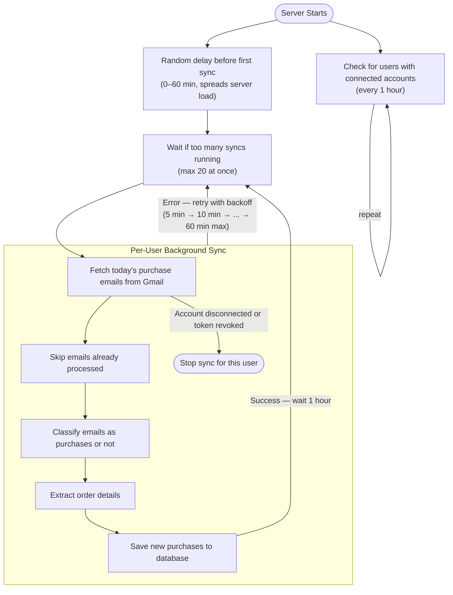

---

---
- Pairing with Fajar benerin migration
TODO
- Poluted health check
- More brand-specific extraction logic. Right now we only have one extraction flow shared across all brands, but we want to make it more deterministic (schema/example-output based, avoiding overfitting, etc.)
- rewrite /airline/search

---

